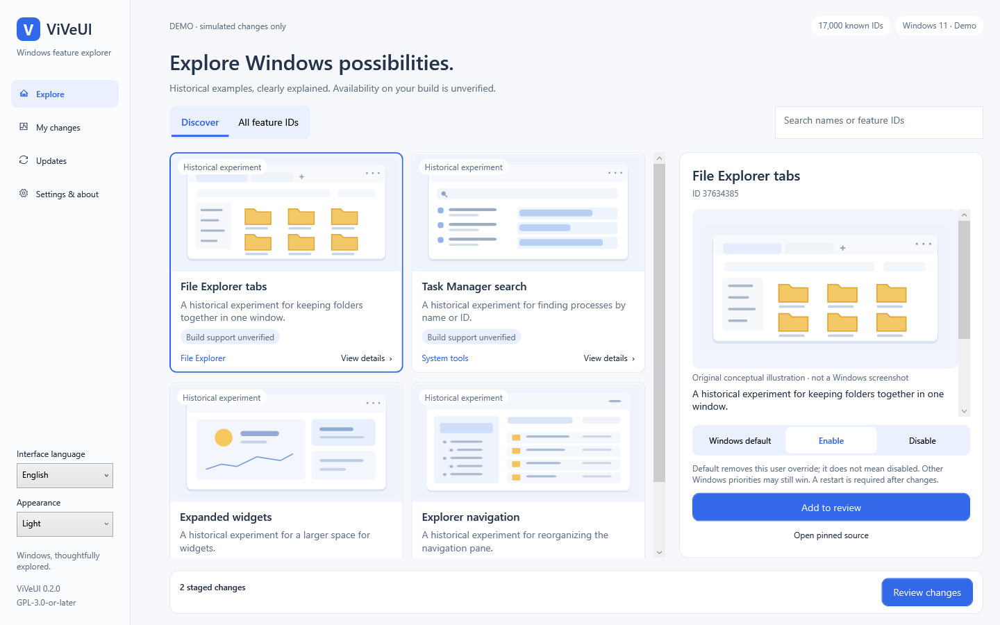

# ViVeUI — Windows feature flag manager

[English](README.md) · [简体中文](README.zh-CN.md) · [Download](https://github.com/BlakeLiAFK/ViVeUI/releases/latest) · [Build status](https://github.com/BlakeLiAFK/ViVeUI/actions/workflows/windows.yml)

**ViVeUI is an open-source C# / WPF Windows desktop app built on the ViVe library.**
Browse 17,000 known feature IDs offline, review Windows default / enable / disable
changes before applying them, and restore recorded user overrides with conflict checks.



## Download and run

| Your Windows PC | Standalone download |
|---|---|
| Intel / AMD x64 | [ViVeUI-win-x64.exe](https://github.com/BlakeLiAFK/ViVeUI/releases/latest/download/ViVeUI-win-x64.exe) |
| ARM64 | [ViVeUI-win-arm64.exe](https://github.com/BlakeLiAFK/ViVeUI/releases/latest/download/ViVeUI-win-arm64.exe) |

Download **one EXE** and run it. There is no installer and no separate .NET runtime
or DLL folder to install. The self-contained application extracts its bundled
runtime into a per-user cache when needed; “single EXE” does not mean zero temporary
files. Packages are unsigned, so Windows may display a publisher warning.

[Release assets](https://github.com/BlakeLiAFK/ViVeUI/releases/latest) also include
`SHA256SUMS.txt`, `BUILD.json`, the complete corresponding source, and license notices.
Source commit and workflow are recorded in BUILD.json. Choose the matching architecture.

Windows 10 build 18963 or newer, including Windows 11, on x64 or ARM64.
A supported OS version does **not** establish support for a particular feature flag.

## What the app does

- **Discover:** four illustrated historical examples with translated, readable names.
- **All IDs:** all 17,000 pinned catalog IDs, search, and inspection of custom unknown IDs.
- **Review:** exact IDs and before/after states, two-step confirmation, and an explicit UAC request.
- **Restore:** recorded snapshots scoped to the affected IDs; conflicting current states block undo.
- **Updates:** GitHub release checks and optional automatic EXE downloads with SHA-256 verification. Installation and launch remain manual.
- **Languages:** 16 complete UI resource sets, native language names, persistent system/manual selection, and Arabic RTL. See [language coverage and review limits](docs/LANGUAGES.md).

Browsing works offline without elevation. A separate worker handles only reviewed
user-priority boot overrides. IPC uses a current-user SID ACL, exact process identity
checks in both directions, and a random handshake challenge. It supports the intended
unelevated UI / elevated worker boundary without using `CurrentUserOnly` pipe options.


## A deliberate workflow

1. Inspect a feature, its provenance, and the limits of what is known.
2. Choose **Windows default**, **Enable**, or **Disable**, then add it to review.
   Returning to the current state cancels any older queued change for that ID.
3. Check every ID and state in the review. Save your work and prepare a recovery path.
4. Approve the reviewed changes and the administrator prompt. Restart manually when ready.
5. Use history to review a scoped restoration if needed.

Experiments can destabilize Windows. Prefer one experiment at a time. Advanced
variant, policy, security, subscription, and Last Known Good settings are outside
this app's writable scope. See [safety and recovery](docs/SAFETY.md).

## Frequently asked questions

### Is ViVeUI the same as ViVeTool?

No. ViVeUI is an independent graphical application built on
[thebookisclosed/ViVe](https://github.com/thebookisclosed/ViVe). It is not a Microsoft
product and is not an official Windows feature-support database.

### Does the catalog contain every Windows feature?

No. The embedded 17,000-ID dictionary is a March 2025 upstream snapshot, pinned to
`3f8c6a3425983412da1e8b26cd757c3aa17b3f25`. A catalog name is not a verified behavior
description. Missing observations do not mean disabled or unsupported.
[Catalog provenance and historical references](docs/CATALOG.md).

### What is the difference between Default, Disable, and Restore?

**Windows default** removes the selected simple user override. **Disable** sets an
explicit disabled override. **Restore** returns to a recorded previous snapshot.
Other Windows priorities may still supersede this user override.

### Are the pictures Windows screenshots?

No. They are original, embedded conceptual schematics. Unknown flags have no claimed
visual preview. Repository screenshots show ViVeUI itself using a fake backend.

### Does ViVeUI install updates silently?

No. Optional automatic downloads verify trusted GitHub release bytes against the
release asset's SHA-256 digest. You decide whether to run the downloaded EXE.
Failed checks, missing digests, and failed verification are explicit errors.

### Does it collect telemetry?

No telemetry is implemented. Catalog browsing is local. Update checks contact GitHub
only when requested or when the startup-check preference is enabled.

## Build, test, and inspect

Open `ViVeUI.sln` in Visual Studio, or use .NET 8 SDK commands:

```powershell
dotnet run --project src/ViVeUI.Tests -c Release
dotnet build src/ViVeUI.Windows -c Release
src/ViVeUI.Windows/bin/Release/net8.0-windows/ViVeUI.exe --smoke
# Run from an elevated test environment; handshake only, no feature writes:
src/ViVeUI.Windows/bin/Release/net8.0-windows/ViVeUI.exe --ipc-smoke
dotnet publish src/ViVeUI.Windows -c Release -r win-x64 --self-contained true
```

Windows CI runs regression tests, native WPF demo interactions, cross-integrity IPC,
and a clean-folder launch containing only the published x64 EXE. ARM64 is built and
packaged; native ARM64 execution, actual feature mutations, Narrator, high-contrast
interaction, and the secure-desktop UAC experience still require manual validation.
[Validation evidence and limits](docs/VALIDATION.md) · [Original design and references](docs/DESIGN.md).

## License and source

GPL-3.0-or-later. Complete pinned ViVe source is retained in `vendor/ViVe`.
The release provides corresponding app/upstream source alongside the executables.
Runtime notices are embedded in the standalone bundles and provided as a separate
license archive. [LICENSE](LICENSE) · [Third-party notices](THIRD-PARTY-NOTICES.md) ·
[Release and update trust](docs/RELEASING.md).
