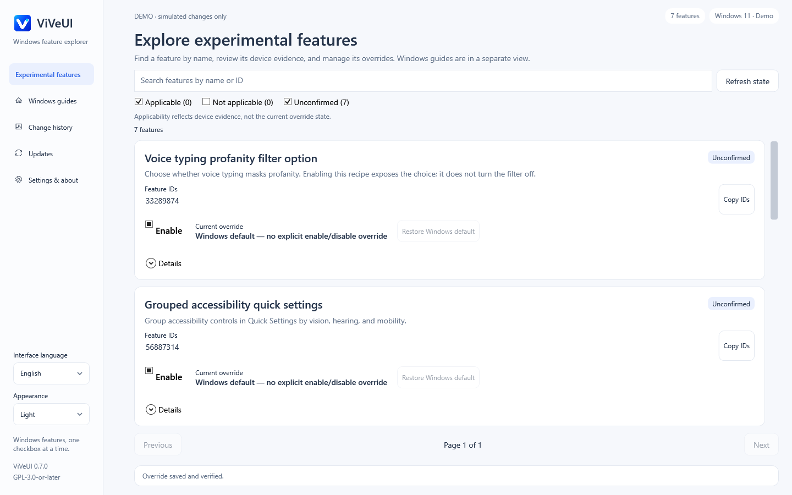

# ViVeUI — Windows feature flag manager

[English](README.md) · [简体中文](README.zh-CN.md) · [Download](https://github.com/BlakeLiAFK/ViVeUI/releases/latest) · [Build status](https://github.com/BlakeLiAFK/ViVeUI/actions/workflows/windows.yml)

**ViVeUI is an open-source C# / WPF Windows desktop app built on the ViVe library.**
The home page presents **7 sourced feature recipes covering 9 IDs**, with direct
controls and device-evidence filters. Settings guides, historical references and
raw-ID inspection remain in a separate Guides area. The embedded 17,000-ID
upstream dictionary is a pinned snapshot, not a universal Windows feature list.

**v0.7.0:** direct feature controls, precise applicability evidence and user-authorized in-place updates. [Validation and limitations](docs/VALIDATION.md).

[Feature recipes and compatibility limits](docs/RECIPES.md) ·
[Update installation and recovery](docs/UPDATE-INSTALLATION.md)



These are native Windows control-tree renders with simulated feature storage. They do not prove that a Windows experiment works. [Preview provenance](docs/previews/v0.7.0/README.md).

## Download and run

| Your Windows PC | Standalone download |
|---|---|
| Intel / AMD x64 | [ViVeUI-win-x64.exe](https://github.com/BlakeLiAFK/ViVeUI/releases/latest/download/ViVeUI-win-x64.exe) |
| ARM64 | [ViVeUI-win-arm64.exe](https://github.com/BlakeLiAFK/ViVeUI/releases/latest/download/ViVeUI-win-arm64.exe) |

Download **one EXE** and run it. There is no installer and no separate .NET runtime
or DLL folder to install. The self-contained application extracts its bundled
runtime into a per-user cache when needed; “single EXE” does not mean zero temporary
files. Packages are unsigned, so Windows may display a publisher warning.

[Release assets](https://github.com/BlakeLiAFK/ViVeUI/releases/latest) also include
`SHA256SUMS.txt`, `BUILD.json`, the complete corresponding source, and license notices.
Source commit and workflow are recorded in BUILD.json. Choose the matching architecture.

Windows 10 build 18963 or newer, including Windows 11, on x64 or ARM64.
A supported OS version does **not** establish support for a particular feature flag.

## What the app does

- **Feature home:** seven reviewed recipes, each with a concrete purpose, exact ID group, sources, applicability and separately reported override state. Two recipes contain two IDs; dependencies do not inflate the feature count.
- **Applicability filters:** Applicable and Unconfirmed start selected; Not applicable starts hidden. These checkboxes filter recipes and do not change Windows. Exact build, update revision (UBR), channel and available prerequisite evidence matter; a nearby or newer build is not automatically compatible.
- **Direct recipe controls:** enable, disable or return the entire approved recipe group to Windows default. An Unconfirmed recipe can be attempted when the required override reads succeed; a Not applicable recipe is blocked. UAC may still be required.
- **Guides and reference:** the separate editorial catalog retains 213 entries: 124 native settings, 25 guides, four shortcuts and 60 read-only archives. These are not 213 additional writable recipes. Raw dictionary entries with unknown purpose remain hidden by default, searchable and paginated when explicitly shown.
- **Manual ID inspection:** enter one decimal, nonzero uint32 ID, including an ID outside the dictionary. Inspection never executes pasted commands or changes a feature by itself. Historical-reference guards still apply to manual/raw operations.
- **History:** read-only operation receipts and per-ID results. It does not replay changes or restore old snapshots automatically.
- **Updates:** trusted GitHub release checks and optional automatic verified downloads. A separate user action authorizes replacement at the current EXE path, with a backup and recovery journal. After replacement, choose whether to restart the app now. Automatic download never authorizes installation or launch.
- **Languages:** 16 UI resource sets, localized catalog content, persistent language selection and Arabic RTL. [Language coverage and review limits](docs/LANGUAGES.md).

Browsing works offline without elevation. A separate authenticated worker handles
requested user-priority boot overrides. It validates an approved recipe's complete
ID group against its own device observations; caller-supplied recipe metadata cannot
expand that group. The existing manual-ID historical guard is not removed by adding
these narrowly scoped recipe operations.

## Read applicability and override state separately

**Applicable** means the implemented evidence checks match a recorded build,
revision and channel, with all recipe IDs observed and any declared prerequisites
satisfied. It is not a device-tested promise that a menu or feature will appear.
**Unconfirmed** means evidence is incomplete or does not match an exact recorded
build. **Not applicable** includes an absent required ID, a known unmet prerequisite,
or a Windows base build below the recipe policy's minimum.

The feature control reports user overrides separately: enabled, disabled, Windows
default, mixed states, or a read error. Query success and write/read-back success
establish configuration facts only; other Windows priorities, rollout state,
installed apps and hardware can affect visible behavior.

1. Read a recipe's purpose, sources, complete ID group and caveats.
2. If eligible, choose enable or disable. The operation runs immediately; approve
   Windows UAC if requested. There is no staging queue or Review step.
3. Read the result and every ID's refreshed state. A group can fail partway through;
   the app does not describe a partial change as a completed feature activation.
4. Windows default removes the recipe IDs' explicit user overrides. It does not
   restore a previously captured custom configuration or guarantee visual rollback.
   Restart Windows manually only when appropriate; unspecified restart evidence is
   not a guarantee that no restart is needed.

The raw/manual path remains separate: known historical IDs reject new enable and
disable requests there, including IDs offered through an approved recipe. Default
removal remains a recovery action under the existing policy. Native settings guides
open Windows settings or explain steps; they do not silently modify settings.

Recipe groups are not transactional Windows operations. An error can leave some
IDs changed and others unchanged. The app rereads the complete group and exposes
per-ID results. Advanced variants, policy, security, subscription and Last Known
Good changes remain outside its writable scope. [Recipe behavior](docs/RECIPES.md) ·
[Safety and recovery](docs/SAFETY.md).

## Frequently asked questions

### Is ViVeUI the same as ViVeTool?

No. ViVeUI is an independent graphical application built on
[thebookisclosed/ViVe](https://github.com/thebookisclosed/ViVe). It is not a Microsoft
product and is not an official Windows feature-support database.

### Does the catalog contain every Windows feature?

No. The embedded 17,000-ID dictionary is a March 2025 upstream snapshot, pinned to
`3f8c6a3425983412da1e8b26cd757c3aa17b3f25`. A catalog name is not a verified behavior
description. Missing observations do not mean disabled or unsupported.
[Catalog provenance and historical references](docs/CATALOG.md).

### What is the difference between Default, Disable, and History?

**Windows default** removes explicit user overrides for the selected recipe group,
or the single inspected ID on the manual path. **Disable** writes an explicit off
state. **History** only shows records; it cannot restore a prior snapshot. Other
Windows priorities may supersede these overrides.

### Are the pictures Windows screenshots?

No. They are original, embedded conceptual schematics. Unknown flags have no claimed
visual preview. The archived v0.5.0 screenshots show ViVeUI itself using a fake backend.
Existing immediate-checkbox renders document the previous interface and carry their
own source/run provenance; they do not validate the new recipe screen.

### Does ViVeUI install updates silently?

No. Automatic downloads stop after verification. You must explicitly request
installation to replace the current EXE; the app keeps the prior EXE for recovery
and then asks whether to restart now. Choosing later leaves the old process running
and the new version at the original path. Failed verification prevents replacement.
[Installation, restart and recovery details](docs/UPDATE-INSTALLATION.md).

### Does it collect telemetry?

No telemetry is implemented. Catalog browsing is local. Update checks contact GitHub
only when requested or when the startup-check preference is enabled.

## Build, test, and inspect

Open `ViVeUI.sln` in Visual Studio, or use .NET 8 SDK commands:

```powershell
dotnet run --project src/ViVeUI.Tests -c Release
dotnet build src/ViVeUI.Windows -c Release
src/ViVeUI.Windows/bin/Release/net8.0-windows/ViVeUI.exe --smoke
# Run from an elevated test environment; handshake only, no feature writes:
src/ViVeUI.Windows/bin/Release/net8.0-windows/ViVeUI.exe --ipc-smoke
dotnet publish src/ViVeUI.Windows -c Release -r win-x64 --self-contained true
```

The Windows workflow covers core logic, native WPF interactions, localization,
packaging and authenticated worker boundaries. Refer to [validation evidence](docs/VALIDATION.md)
for the exact version, commit and run actually tested. Earlier passing counts or
screenshots do not validate the v0.7 recipe or self-update changes. New test outcomes
and release artifacts must be recorded after their matching runs complete.

Real feature mutations, ARM64 execution, physical DPI behavior, Narrator,
high-contrast interaction, native-speaker translation review and secure-desktop
UAC consent remain outside this automated validation. Reproduce the fake-storage
renders with `pwsh tools/New-WindowsPreviews.ps1 -Run` on Windows.
[Original design and references](docs/DESIGN.md).

## License and source

GPL-3.0-or-later. Complete pinned ViVe source is retained in `vendor/ViVe`.
The release provides corresponding app/upstream source alongside the executables.
Runtime notices are embedded in the standalone bundles and provided as a separate
license archive. [LICENSE](LICENSE) · [Third-party notices](THIRD-PARTY-NOTICES.md) ·
[Release and update trust](docs/RELEASING.md).
