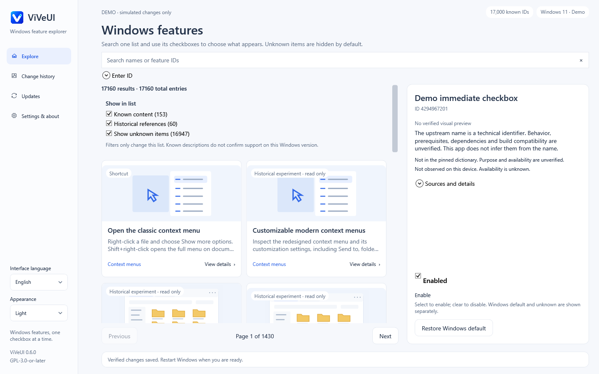

# ViVeUI — Windows feature flag manager

[English](README.md) · [简体中文](README.zh-CN.md) · [Download](https://github.com/BlakeLiAFK/ViVeUI/releases/latest) · [Build status](https://github.com/BlakeLiAFK/ViVeUI/actions/workflows/windows.yml)

**ViVeUI is an open-source C# / WPF Windows desktop app built on the ViVe library.**
Browse 17,000 known feature IDs offline. For an eligible raw feature ID, check to
enable or uncheck to disable immediately; Windows default removes its explicit
user override. There is no staging queue, Review page or extra app confirmation.
Windows may still request administrator consent through UAC.

**v0.6.0:** direct checkbox operations, one filtered card gallery, and manual ID inspection.




Actual WPF renders from Windows CI with simulated feature storage; no system settings were changed.
[Native preview provenance](docs/previews/README.md) · [Original flow schematic](docs/previews/immediate-toggle-flow.svg)

## Download and run

| Your Windows PC | Standalone download |
|---|---|
| Intel / AMD x64 | [ViVeUI-win-x64.exe](https://github.com/BlakeLiAFK/ViVeUI/releases/latest/download/ViVeUI-win-x64.exe) |
| ARM64 | [ViVeUI-win-arm64.exe](https://github.com/BlakeLiAFK/ViVeUI/releases/latest/download/ViVeUI-win-arm64.exe) |

Download **one EXE** and run it. There is no installer and no separate .NET runtime
or DLL folder to install. The self-contained application extracts its bundled
runtime into a per-user cache when needed; “single EXE” does not mean zero temporary
files. Packages are unsigned, so Windows may display a publisher warning.

[Release assets](https://github.com/BlakeLiAFK/ViVeUI/releases/latest) also include
`SHA256SUMS.txt`, `BUILD.json`, the complete corresponding source, and license notices.
Source commit and workflow are recorded in BUILD.json. Choose the matching architecture.

Windows 10 build 18963 or newer, including Windows 11, on x64 or ARM64.
A supported OS version does **not** establish support for a particular feature flag.

## What the app does

- **One list:** sourced content and the 17,000-ID pinned dictionary share one searchable list, without a separate All IDs view. The editorial layer contains 213 distinct entries: 124 native settings, 25 guides, four shortcuts and 60 read-only archives—not 213 writable toggles.
- **Checkbox filters:** Known content (153) and Historical references (60) start checked. Show unknown (16,944) starts unchecked. These three visible filters only change which entries appear; there are no filter dropdowns.
- **Bounded pages:** every list page contains at most 12 cards, including when unknown entries are visible. Search and filters stay above the cards; page controls sit below them.
- **Enter ID:** a separate read-only inspection field accepts one decimal, nonzero uint32 ID, including an ID outside the dictionary. Paste it and press Enter. It never runs pasted text as a command or automatically changes a feature.
- **Direct controls:** check to enable or uncheck to disable an eligible raw ID. Changes run immediately through the privileged worker, with UAC when required; no staging or additional app confirmation.
- **History:** a read-only record of operation results. It does not replay or undo changes. Use the separate per-feature Windows default action to remove that ID’s explicit override.
- **Updates:** GitHub release checks and optional automatic EXE downloads with SHA-256 verification. Installation and launch remain manual.
- **Languages:** 16 UI resource sets plus fully localized catalog titles, instructions, search terms and evidence, native language names, persistent system/manual selection, and Arabic RTL. See [language coverage and review limits](docs/LANGUAGES.md).

Browsing works offline without elevation. A separate worker handles only requested
user-priority boot overrides. IPC uses a current-user SID ACL, exact process identity
checks in both directions, and a random handshake challenge. It supports the intended
unelevated UI / elevated worker boundary without using `CurrentUserOnly` pipe options.

## Find content, then operate

The three list-filter checkboxes are separate from the selected feature’s Enable
checkbox. An exact numeric match hidden by a filter prompts you to enable the
relevant filter; searching never silently exposes it or changes filter choices.
Manual Enter ID inspection is a separate, explicit request to inspect that one ID;
it does not change search filters or reveal other hidden matches. IDs outside the
dictionary have unknown availability; accepting a number does not prove a valid
or supported Windows feature.

Known purpose does not mean this Windows build supports the feature. Unknown
purpose describes missing editorial evidence, not an unknown observed system state.

1. Inspect the ID, source and compatibility limits. Save work before experimenting.
2. For an eligible raw ID, check its control to enable or uncheck it to disable.
   The request runs immediately; approve Windows UAC if requested.
3. Read the resulting override state or error. A canceled or failed operation must
   not be treated as a successful change. Restart Windows manually when appropriate.
4. Use the separate Windows default action for the selected ID to remove its
   explicit override. History is view-only; it does not offer scoped undo.

An unchecked control is not proof of Windows default: disabled and default remain
separate states. The displayed state is a user override, not guaranteed effective
runtime behavior. Selecting a catalog card or browsing an ID does not write settings.

Known historical reference IDs reject new enable/disable requests in both the UI and elevated worker. Removing their user override with Windows default remains available for recovery; this does not guarantee safe OS behavior. Native settings cards navigate to Windows without changing it.

Experiments can destabilize Windows. Prefer one experiment at a time. Advanced
variant, policy, security, subscription, and Last Known Good settings are outside
this app's writable scope. Errors remain visible with their operation results; no failed operation is retained in a staging queue. See [safety and recovery](docs/SAFETY.md).

## Frequently asked questions

### Is ViVeUI the same as ViVeTool?

No. ViVeUI is an independent graphical application built on
[thebookisclosed/ViVe](https://github.com/thebookisclosed/ViVe). It is not a Microsoft
product and is not an official Windows feature-support database.

### Does the catalog contain every Windows feature?

No. The embedded 17,000-ID dictionary is a March 2025 upstream snapshot, pinned to
`3f8c6a3425983412da1e8b26cd757c3aa17b3f25`. A catalog name is not a verified behavior
description. Missing observations do not mean disabled or unsupported.
[Catalog provenance and historical references](docs/CATALOG.md).

### What is the difference between Default, Disable, and History?

**Windows default** removes the selected simple user override. **Disable** sets an
explicit disabled override. **History** only shows operation records; it cannot
restore a prior snapshot. Other Windows priorities may supersede this user override.

### Are the pictures Windows screenshots?

No. They are original, embedded conceptual schematics. Unknown flags have no claimed
visual preview. The archived v0.5.0 screenshots show ViVeUI itself using a fake backend.
Current immediate-checkbox UI renders are separately recorded with exact source/run provenance.

### Does ViVeUI install updates silently?

No. Optional automatic downloads verify trusted GitHub release bytes against the
release asset's SHA-256 digest. You decide whether to run the downloaded EXE.
Failed checks, missing digests, and failed verification are explicit errors.

### Does it collect telemetry?

No telemetry is implemented. Catalog browsing is local. Update checks contact GitHub
only when requested or when the startup-check preference is enabled.

## Build, test, and inspect

Open `ViVeUI.sln` in Visual Studio, or use .NET 8 SDK commands:

```powershell
dotnet run --project src/ViVeUI.Tests -c Release
dotnet build src/ViVeUI.Windows -c Release
src/ViVeUI.Windows/bin/Release/net8.0-windows/ViVeUI.exe --smoke
# Run from an elevated test environment; handshake only, no feature writes:
src/ViVeUI.Windows/bin/Release/net8.0-windows/ViVeUI.exe --ipc-smoke
dotnet publish src/ViVeUI.Windows -c Release -r win-x64 --self-contained true
```

Windows CI validates 132 core tests, native WPF interactions, all sixteen languages,
Arabic RTL, checkbox filters, twelve-card pagination, manual ID inspection and
read-only historical entries. It packages x64 and ARM64 self-contained EXEs and
launches the x64 EXE from a clean directory. Authenticated elevation IPC tests
perform no feature writes. See the exact runs and artifacts in
[validation evidence](docs/VALIDATION.md).

Real feature mutations, ARM64 execution, physical DPI behavior, Narrator,
high-contrast interaction, native-speaker translation review and secure-desktop
UAC consent remain outside this automated validation. Reproduce the fake-storage
renders with `pwsh tools/New-WindowsPreviews.ps1 -Run` on Windows.
[Original design and references](docs/DESIGN.md).

## License and source

GPL-3.0-or-later. Complete pinned ViVe source is retained in `vendor/ViVe`.
The release provides corresponding app/upstream source alongside the executables.
Runtime notices are embedded in the standalone bundles and provided as a separate
license archive. [LICENSE](LICENSE) · [Third-party notices](THIRD-PARTY-NOTICES.md) ·
[Release and update trust](docs/RELEASING.md).
