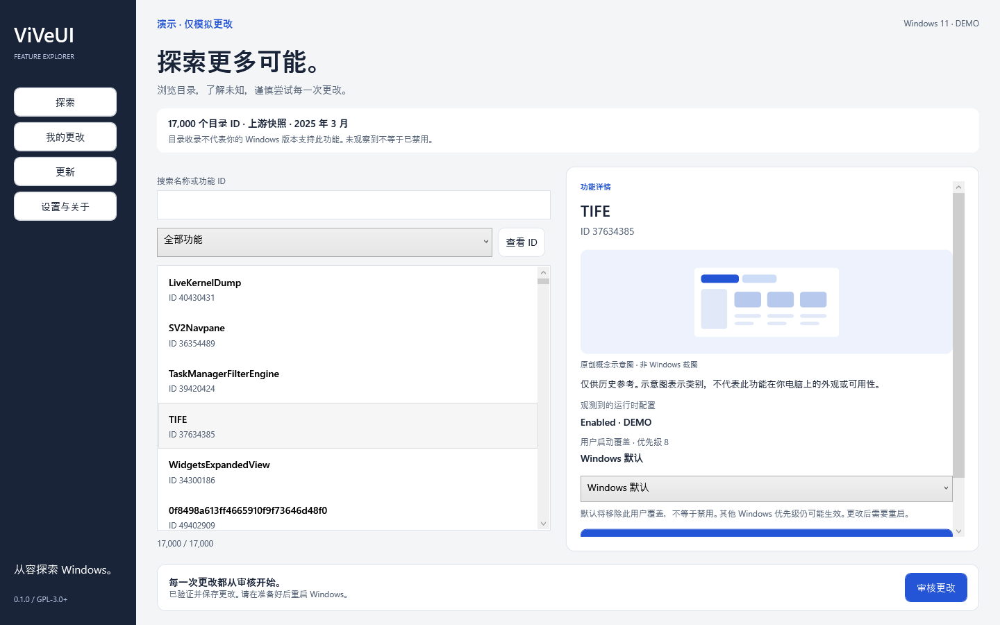
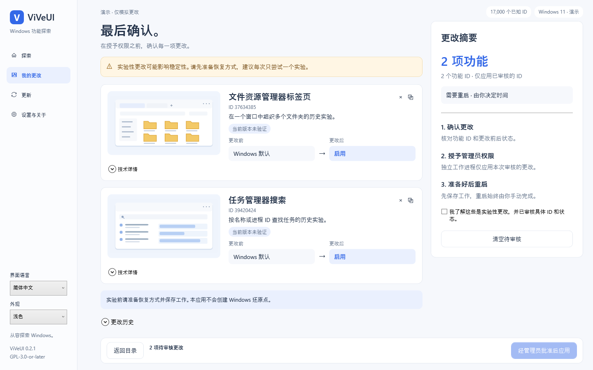

# ViVeUI — Windows 功能标志管理器

[English](README.md) · [简体中文](README.zh-CN.md) · [下载发行版](https://github.com/BlakeLiAFK/ViVeUI/releases/latest)

**ViVeUI 是基于 ViVe 库开发的开源 C# / WPF Windows 桌面应用。**
离线浏览 17,000 个已知功能 ID，先审核“Windows 默认 / 启用 / 禁用”的更改，
再申请管理员权限；需要恢复时，仅恢复历史记录涉及的覆盖，并检查冲突。

## 下载与运行

| 电脑架构 | 独立可执行文件 |
|---|---|
| Intel / AMD x64 | [下载 ViVeUI-win-x64.exe](https://github.com/BlakeLiAFK/ViVeUI/releases/latest/download/ViVeUI-win-x64.exe) |
| ARM64 | [下载 ViVeUI-win-arm64.exe](https://github.com/BlakeLiAFK/ViVeUI/releases/latest/download/ViVeUI-win-arm64.exe) |

只需下载并运行 **一个 EXE**。无需安装器，无需另装 .NET，也无需附带 DLL 文件夹。
程序包含运行时，必要时会解压到当前用户的缓存目录；单文件分发不意味着运行时零临时文件。
当前二进制未进行代码签名，Windows 可能显示发布者提示。

[发行页面](https://github.com/BlakeLiAFK/ViVeUI/releases/latest) 同时提供 SHA256 校验文件、
构建提交信息、完整对应源码与许可证说明。请选择正确架构。
支持 Windows 10 build 18963 及更新版本（包括 Windows 11）的 x64 / ARM64 系统。
操作系统受支持，不代表某个实验性功能一定适用。

## 功能与使用流程

- 精选探索：四个历史实验示例、原创示意图与易懂的中文名称。
- 全部 ID：保留完整的 17,000 项固定版本目录，可搜索并查看自定义未知 ID。
- 更改审核：逐项显示 ID、修改前后状态；确认后才启动提权工作进程。
- 历史恢复：使用已记录的快照，仅处理相关 ID；发现当前状态冲突时停止。
- 更新：检查 GitHub 发行版，可选择自动下载并验证 EXE；不会静默安装或启动。
- 多语言：16 套完整界面资源，原生语言名称、持久化系统/手动语言选择及阿拉伯语 RTL。详见[覆盖范围与审校限制](docs/LANGUAGES.md)。

1. 查看功能与来源，了解未知的兼容性和依赖关系。
2. 选择默认、启用或禁用，加入待审核列表。选回当前状态会取消之前排队的更改。
3. 核对每个 ID 与目标状态，保存工作并准备恢复方式。
4. 确认更改，批准管理员提示；准备好后手动重启。
5. 必要时从历史记录审核恢复，不进行全局重置。

实验性更改可能导致 Windows 不稳定，建议每次只尝试一个实验。
本应用仅编辑简单的用户级启动覆盖，不修改策略、安全、变体、订阅或 Last Known Good 配置。
[安全与恢复说明](docs/SAFETY.md)。

## 常见问题

### 这是官方 ViVeTool 或微软产品吗？

不是。ViVeUI 是基于 [thebookisclosed/ViVe](https://github.com/thebookisclosed/ViVe)
开发的独立图形应用，不是微软官方产品，也不是官方功能兼容性数据库。

### 17,000 个 ID 是全部 Windows 功能吗？

不是。这是上游 2025 年 3 月字典的固定快照，提交为
`3f8c6a3425983412da1e8b26cd757c3aa17b3f25`。目录收录不等于当前版本可用；
未观察到也不等于禁用或不支持。[目录来源](docs/CATALOG.md)。

### “默认”“禁用”和“恢复”有什么区别？

默认移除指定的简单用户覆盖；禁用写入显式禁用覆盖；恢复回到已记录的原始快照。
其他 Windows 优先级仍可能覆盖该用户设置。

### 图片是 Windows 功能的真实截图吗？

不是。图片是内嵌原创概念示意图，不承诺功能实际外观；未知功能没有伪造的预览。
仓库中的界面截图来自 ViVeUI 自身的模拟后端，不会修改真实系统功能。

### 是否收集遥测或自动安装更新？

没有实现遥测。浏览目录离线运行。只有手动检查更新，或启用启动检查选项时才访问 GitHub。
下载需通过 GitHub SHA-256 摘要校验；安装和运行始终由你决定。

## 验证范围与许可证

Windows CI 验证核心逻辑、WPF 模拟交互、跨完整性级别 IPC，以及只含一个 EXE 的干净目录启动。
ARM64 已构建打包；真实功能写入、ARM64 原生运行、讲述人、高对比度交互及安全桌面的 UAC
体验仍需人工验证。[验证记录](docs/VALIDATION.md)。

GPL-3.0-or-later；保留完整固定版本上游源码，发行页提供对应源码及运行时许可证。
[LICENSE](LICENSE) · [第三方说明](THIRD-PARTY-NOTICES.md)。

## 0.4.0 体验改进

精选目录扩展为 20 项：15 个有来源的 Windows 原生指南与 5 个明确标为历史的 ViVe 实验。右键专题位于首列，经典菜单使用官方「显示更多选项」/Shift + 右键方法；不伪造经典菜单功能 ID，也不写入未经验证的注册表调整。

新增多尺寸应用图标、统一下拉列表、当前语言的精选搜索、逐项应用结果、失败队列保留及不覆盖无关修改的历史恢复。缩放设置可持久化；下载可取消且不再锁定变更编辑；关闭时保护待处理队列。
