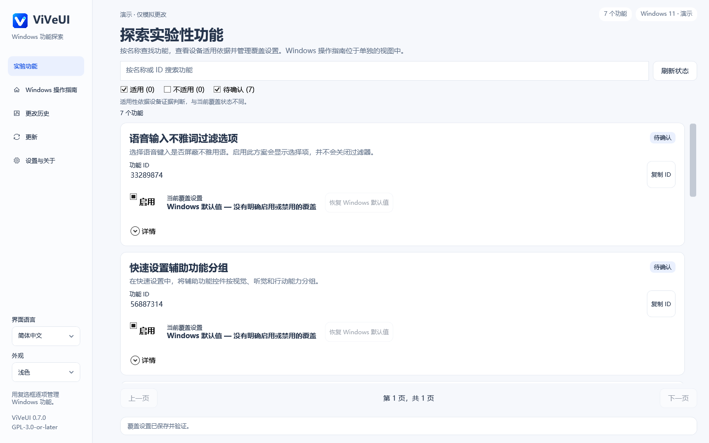

# ViVeUI — Windows 功能标志管理器

[English](README.md) · [简体中文](README.zh-CN.md) · [下载发行版](https://github.com/BlakeLiAFK/ViVeUI/releases/latest)

**ViVeUI 是基于 ViVe 库开发的开源 C# / WPF Windows 桌面应用。**
首页提供 **7 个有原始来源的实验功能方案，共 9 个 ID**。每张卡同时显示名称、用途、
可复制 ID、当前覆盖状态和直接启用复选框。设置教程与历史资料在独立页面。
17,000 个 ID 是固定上游字典快照，不是所有 Windows 功能的完整列表。

v0.7 增加功能首页和用户主动触发的原位置更新。原生测试及发布记录见
[验证说明](docs/VALIDATION.md)；下载链接始终指向最新已发布版本。

[原生截图与来源记录](docs/previews/v0.7.0/README.md)。功能操作使用模拟存储，不修改真实系统设置。

## 下载与运行

| 电脑架构 | 独立可执行文件 |
|---|---|
| Intel / AMD x64 | [下载 ViVeUI-win-x64.exe](https://github.com/BlakeLiAFK/ViVeUI/releases/latest/download/ViVeUI-win-x64.exe) |
| ARM64 | [下载 ViVeUI-win-arm64.exe](https://github.com/BlakeLiAFK/ViVeUI/releases/latest/download/ViVeUI-win-arm64.exe) |

只需下载并运行 **一个 EXE**。无需安装器，无需另装 .NET，也无需附带 DLL 文件夹。
程序包含运行时，必要时会解压到当前用户的缓存目录；单文件分发不意味着运行时零临时文件。
当前二进制未进行代码签名，Windows 可能显示发布者提示。

[发行页面](https://github.com/BlakeLiAFK/ViVeUI/releases/latest) 同时提供 SHA256 校验文件、
构建提交信息、完整对应源码与许可证说明。请选择正确架构。
支持 Windows 10 build 18963 及更新版本（包括 Windows 11）的 x64 / ARM64 系统。
操作系统受支持，不代表某个实验性功能一定适用。

## 使用方法

1. 在首页按名称或 ID 搜索功能，直接勾选启用；多 ID 方案一次提交完整组，必要时只显示 Windows UAC。
2. 查看读回状态。取消、写入失败或部分成功不会显示成整组已启用；每个 ID 的结果可在详情查看。
3. 取消勾选写入禁用覆盖；“恢复 Windows 默认”移除该组的显式用户覆盖。默认与禁用不同。

“适用 / 不适用 / 待确认”是独立的显示筛选，默认显示适用和待确认，每页最多 12 项。
适用性依据精确 build、更新修订号 UBR、channel 和已知前提；相邻版本、较新版本或
查询到 ID 都不构成兼容保证。没有足够证据时标为待确认，仍可直接尝试这 7 个限定方案。
查询不到配置也不代表功能不存在。写入成功只表示覆盖读回一致，不保证 Windows 外观变化。
[方案来源与限制](docs/RECIPES.md)。

独立的 Windows 指南页保留 213 项设置入口、教程和历史资料，它们不是 213 个可写功能。
高级手动 ID 查询保留，支持未收录 ID；历史危险条目的保护没有整体取消。
历史记录只读，不自动重放旧操作。浏览、搜索和复制均不写入系统功能。

更新页点击“安装更新”后，验证官方仓库、版本、SHA-256、大小及实际 EXE 架构，
把旧文件改名备份并将新文件放回原路径，然后询问是否重启应用。
选择稍后，旧进程继续运行；自动下载不授权自动安装或启动。
[更新替换与恢复](docs/UPDATE-INSTALLATION.md)。

支持 16 种界面语言、阿拉伯语 RTL、语言和缩放持久化。
应用只编辑简单的用户级启动覆盖，不修改策略、安全、变体、订阅或 Last Known Good 配置。
[安全与恢复说明](docs/SAFETY.md)。

## 常见问题

### 这是官方 ViVeTool 或微软产品吗？

不是。ViVeUI 是基于 [thebookisclosed/ViVe](https://github.com/thebookisclosed/ViVe)
开发的独立图形应用，不是微软官方产品，也不是官方功能兼容性数据库。

### 17,000 个 ID 是全部 Windows 功能吗？

不是。这是上游 2025 年 3 月字典的固定快照，提交为
`3f8c6a3425983412da1e8b26cd757c3aa17b3f25`。目录收录不等于当前版本可用；
未观察到也不等于禁用或不支持。[目录来源](docs/CATALOG.md)。

### “默认”“禁用”和“历史”有什么区别？

默认移除指定的简单用户覆盖；禁用写入显式禁用覆盖；历史仅显示操作记录，不恢复旧快照。
其他 Windows 优先级仍可能覆盖该用户设置。

### 图片是 Windows 功能的真实截图吗？

不是。图片是内嵌原创概念示意图，不承诺功能实际外观；未知功能没有伪造的预览。
归档中的旧版界面截图来自 ViVeUI 自身的模拟后端，不修改真实系统功能。
新版界面截图来自 Windows 原生控件渲染；旧图单独归档，不冒充当前版本。

### 是否收集遥测或自动安装更新？

没有实现遥测。浏览目录离线运行。只有手动检查更新，或启用启动检查选项时才访问 GitHub。
下载需通过 GitHub SHA-256 摘要校验；安装和运行始终由你决定。

## 验证范围与许可证

[精确提交、Windows CI 与验证记录](docs/VALIDATION.md)说明每个版本的执行证据。
核心测试及功能界面测试使用模拟存储，不修改真实系统功能。
自更新测试只替换隔离的官方应用副本。ARM64 打包不等于 ARM64 实机运行，
模拟功能测试也不证明用户设备上的实验效果。
可在 Windows 上运行 `pwsh tools/New-WindowsPreviews.ps1 -Run` 重现控件截图。

GPL-3.0-or-later；保留完整固定版本上游源码，发行页提供对应源码及运行时许可证。
[LICENSE](LICENSE) · [第三方说明](THIRD-PARTY-NOTICES.md)。
