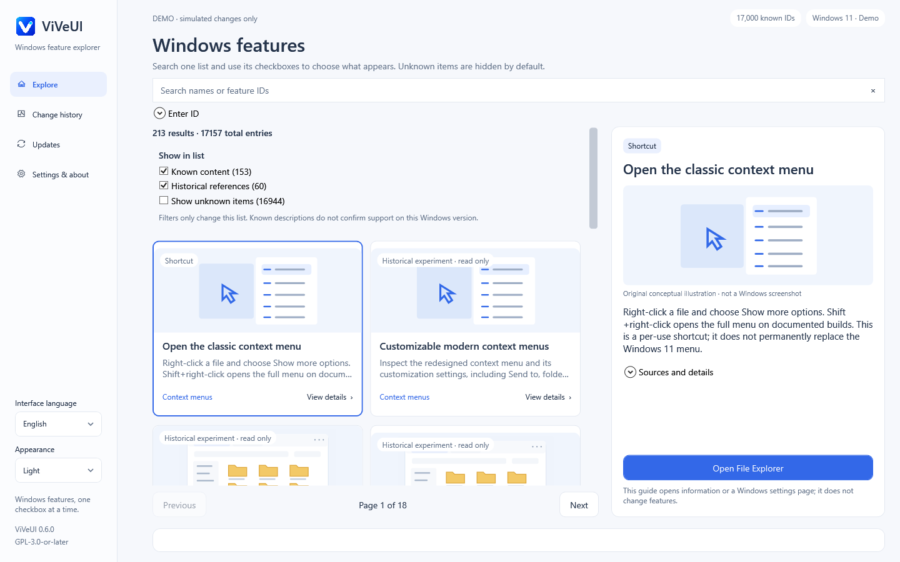

# ViVeUI — Windows 功能标志管理器

[English](README.md) · [简体中文](README.zh-CN.md) · [下载发行版](https://github.com/BlakeLiAFK/ViVeUI/releases/latest)

**ViVeUI 是基于 ViVe 库开发的开源 C# / WPF Windows 桌面应用。**
离线浏览 17,000 个已知功能 ID。对允许操作的原始 ID，勾选即启用、取消勾选即禁用；
“Windows 默认”单独移除显式用户覆盖。不再加入队列、进入审核页或经过额外的应用确认框，
需要管理员权限时仍由 Windows 显示 UAC 提示。

**v0.6.0：**直接勾选、统一复选框筛选、每页 12 张卡片，以及独立的手动 ID 查询。

这些图片由 Windows CI 运行真实 WPF 控件生成，使用模拟后端，未修改系统设置。
[截图来源与验证记录](docs/previews/README.md) · [原创流程示意图](docs/previews/immediate-toggle-flow.svg)

## 下载与运行

| 电脑架构 | 独立可执行文件 |
|---|---|
| Intel / AMD x64 | [下载 ViVeUI-win-x64.exe](https://github.com/BlakeLiAFK/ViVeUI/releases/latest/download/ViVeUI-win-x64.exe) |
| ARM64 | [下载 ViVeUI-win-arm64.exe](https://github.com/BlakeLiAFK/ViVeUI/releases/latest/download/ViVeUI-win-arm64.exe) |

只需下载并运行 **一个 EXE**。无需安装器，无需另装 .NET，也无需附带 DLL 文件夹。
程序包含运行时，必要时会解压到当前用户的缓存目录；单文件分发不意味着运行时零临时文件。
当前二进制未进行代码签名，Windows 可能显示发布者提示。

[发行页面](https://github.com/BlakeLiAFK/ViVeUI/releases/latest) 同时提供 SHA256 校验文件、
构建提交信息、完整对应源码与许可证说明。请选择正确架构。
支持 Windows 10 build 18963 及更新版本（包括 Windows 11）的 x64 / ARM64 系统。
操作系统受支持，不代表某个实验性功能一定适用。

## 功能与使用流程

- 统一列表：来源说明与 17,000 项固定 ID 字典在同一列表搜索，不再切换独立的“全部 ID”视图。说明层保留 213 个去重条目：124 个原生设置、25 个指南、4 个快捷操作和 60 个只读档案，不是 213 个可写开关。
- 勾选筛选：“已知内容（153）”“历史引用（60）”默认勾选，“显示未知（16,944）”默认不勾选。三个可见复选框只控制列表显示，不使用筛选下拉框。
- 固定分页：包括显示未知项时，每页也最多 12 张卡片。搜索和筛选位于卡片上方，翻页按钮位于卡片下方。
- 输入 ID：独立的只读查看入口，接受单个非零 uint32 十进制 ID，包括字典未收录的 ID；粘贴后按 Enter 查看。不会把输入作为命令执行，也不会自动修改功能。
- 即时操作：对允许操作的原始 ID，勾选或取消勾选立即执行，仅保留必要的 Windows UAC；没有待审核队列和额外应用确认。
- 操作历史：只读查看操作结果，不重放或撤销更改。通过每个 ID 单独的“Windows 默认”操作移除其显式覆盖。
- 更新：检查 GitHub 发行版，可选择自动下载并验证 EXE；不会静默安装或启动。
- 多语言：16 套界面资源及完整目录标题、正文、搜索词和证据说明，原生语言名称、持久化系统/手动语言选择及阿拉伯语 RTL。详见[覆盖范围与审校限制](docs/LANGUAGES.md)。

列表的三个筛选复选框与所选功能的“启用”执行复选框相互独立。精确输入数字 ID 后，
若结果被筛选隐藏，只提示勾选相应筛选项，不自动展示、不偷偷改变筛选选择。
手动“输入 ID”是明确查看该单个 ID 的独立操作，不改变搜索筛选，也不展示其他隐藏结果。
未收录 ID 的可用性未知；接受数值不代表它是有效或受支持的 Windows 功能。
用途已知不代表当前 Windows 支持；用途未知指缺少内容证据，不等于系统当前状态未知。

1. 查看 ID、来源及兼容性限制，实验前保存工作。
2. 对允许操作的原始 ID，勾选启用或取消勾选禁用，操作立即开始；必要时批准 Windows UAC。
3. 查看最终覆盖状态或错误。取消或失败不能视为修改成功；按需手动重启 Windows。
4. 用所选 ID 单独的“Windows 默认”操作移除显式覆盖。历史仅供查看，不提供限定范围撤销。

未勾选不等于“Windows 默认”：默认与显式禁用仍分别显示。用户覆盖也不保证当前运行时实际行为。
浏览目录、选择卡片或查看 ID 不会写入系统设置。

已知历史引用 ID 在界面和提权工作进程均拒绝新的启用/禁用操作；为恢复而移除用户覆盖的“默认”仍可用，但不保证系统行为安全。原生卡片仅跳转 Windows 设置，不自动修改。

实验性更改可能导致 Windows 不稳定，建议每次只尝试一个实验。
本应用仅编辑简单的用户级启动覆盖，不修改策略、安全、变体、订阅或 Last Known Good 配置。
[安全与恢复说明](docs/SAFETY.md)。

## 常见问题

### 这是官方 ViVeTool 或微软产品吗？

不是。ViVeUI 是基于 [thebookisclosed/ViVe](https://github.com/thebookisclosed/ViVe)
开发的独立图形应用，不是微软官方产品，也不是官方功能兼容性数据库。

### 17,000 个 ID 是全部 Windows 功能吗？

不是。这是上游 2025 年 3 月字典的固定快照，提交为
`3f8c6a3425983412da1e8b26cd757c3aa17b3f25`。目录收录不等于当前版本可用；
未观察到也不等于禁用或不支持。[目录来源](docs/CATALOG.md)。

### “默认”“禁用”和“历史”有什么区别？

默认移除指定的简单用户覆盖；禁用写入显式禁用覆盖；历史仅显示操作记录，不恢复旧快照。
其他 Windows 优先级仍可能覆盖该用户设置。

### 图片是 Windows 功能的真实截图吗？

不是。图片是内嵌原创概念示意图，不承诺功能实际外观；未知功能没有伪造的预览。
归档中的旧版界面截图来自 ViVeUI 自身的模拟后端，不修改真实系统功能。
新版界面截图来自 Windows 原生控件渲染；旧图单独归档，不冒充当前版本。

### 是否收集遥测或自动安装更新？

没有实现遥测。浏览目录离线运行。只有手动检查更新，或启用启动检查选项时才访问 GitHub。
下载需通过 GitHub SHA-256 摘要校验；安装和运行始终由你决定。

## 验证范围与许可证

Windows CI 验证 132 项核心测试、真实 WPF 控件交互、16 种语言、RTL、复选框筛选、
每页 12 张卡片、手动 ID 查询及历史条目只读保护。流水线打包 x64、ARM64 独立 EXE，
并从仅有一个 EXE 的干净目录启动 x64 版本。跨权限 IPC 测试不执行功能写入。
[精确提交、CI 与验证记录](docs/VALIDATION.md)。

真实系统功能写入、ARM64 实机运行、物理 DPI、讲述人、高对比度交互、母语审校及
安全桌面 UAC 同意操作尚未覆盖，不将模拟后端测试等同真实系统功能验证。
可在 Windows 上运行 `pwsh tools/New-WindowsPreviews.ps1 -Run` 重现控件截图。

GPL-3.0-or-later；保留完整固定版本上游源码，发行页提供对应源码及运行时许可证。
[LICENSE](LICENSE) · [第三方说明](THIRD-PARTY-NOTICES.md)。

## 目录与交互

精选目录扩展为 213 个去重条目，全部具备 16 语标题、正文、关键词与证据说明；60 个功能档案只读，不将依赖 ID 或同一功能的参数重复计数。右键专题位于首列，经典菜单使用官方「显示更多选项」/Shift + 右键方法；不伪造经典菜单功能 ID，也不写入未经验证的注册表调整。

保留多尺寸应用图标、统一下拉列表、当前语言搜索、历史记录及缩放持久化。新版移除排队、审核与重复确认，以即时勾选操作替代；历史条目只读，原生设置仍只负责导航。更新下载可取消，安装始终由用户决定。
